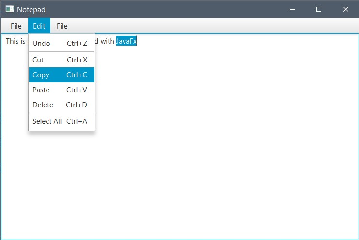

# Notepad with JavaFX

## About Notepad

> Notepad is a text editor, i.e., an app specialized in editing plain text. It can edit text files (bearing the ". txt" filename extension)

## Application Structure

### 1. `Notepad.java`: Contains the main class that contains the `main` method and creates objects from `ViewsCreator` and `ActionsHandler`

### 2. `ViewsCreator.java`: The class that responsible for creating the GUI elements and setting event actions

### 3. `ActionsHandler.java`: The class contians all functionality of the application (Handle Actions)

### 4. `StorageManager.java`: The class that manages reading the writing to the files
